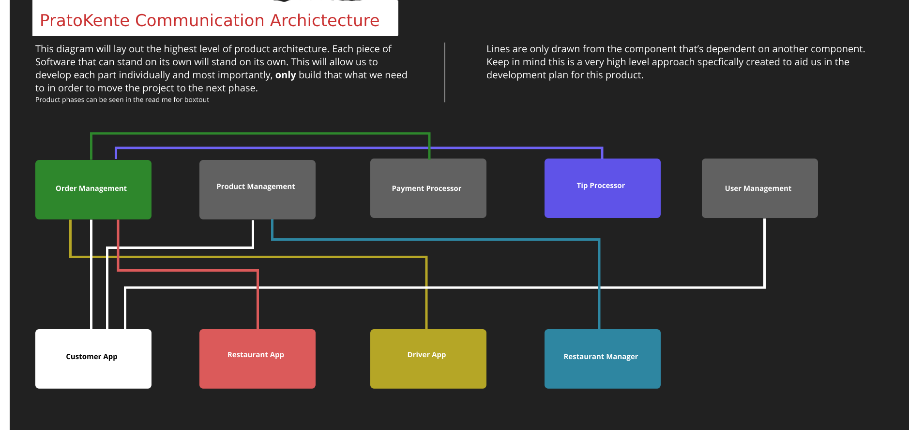

# pratokente

A Food Delivery System 

## Products Overview
This is the application that the customer will be using to order their food. To have a customer we need a way to manage all the users infomation. So we need a User Manager. In addition to that, if we want to order we need a backend to manage orders. We’ll build that using Firestore DB in the Firebase suite. But before the user can place any order they need to be able to choose a product. So the backend should also store all the products, we’ll use Firestore DB for that as well. But where do these products come from and who do they belong to? Well, we’ll need a Restaurant manager to allow restaurants to manage their own menu’s, opening times, locations and general information.
But before we can even capture that order we need to take payment. So we’ll need to build a payment system that can process credit card payments, attach receipts and make sure that there’s no faulty transactions on the orders.
So now we have the information that will be shown in the app through the Restaurant manager, all that information is stored on the backend Firestore DB. When the user places an order on the Customer app it goes into our order management backend system which will be built using firebase functions and the order is placed. Now what?
## Restaurant Application

This application goes into the Restaurant that’s signed up to our service so they can manage it from there. This application will be connected to our backend to manage orders for the specific restaurant. They will be able to select an order and indicate to us how long it’ll take to complete, then they’ll be able to mark it ready for when the driver can pick it up. So this application will be solely for the restaurant to give updates to the customer that ordered the meal. Did I just say driver? Well how will they know what’s happening. That’s where the Driver app comes in.

## Driver Application
This application is specifically designed for the drivers. It’s to notify them if they have an order to pick up. They will get a firebase notification which will tell them there’s an order up for grabs in their area. They can then accept the order which will be assigned to them and they will get the locations of where to pick up and where to drop off. The driver app will complete the order process and mark the order as delivered and completed. What about the drivers tip?
Well the tip is sent from the customer app in the order but we’ll have to process that and when the driver has delivered we’ll assign that tip to their account for payout at the end of the month. For that we’ll need some specific functionality for Tip processing. Lets tally up everything mentioned above that has to be built.
Backend to manage orders
Since everything will be done on Firebase, each of the “backend” systems will be a serverless set of cloud functions that we’ll deploy to manage these parts for us. The order management system will be a set of serverless functions that will focus only on managing the orders. It will take the order in, send the required information to the payment processor, send the information to the tip processor, Add the order into the DB, update the order status accordingly and send out the appropriate notifications.

## Backend to manage products
This set of serverless functions will be dedicated to the management of products and menus from Restaurants. It will store the products as added by the restaurant manager, and allow the applications to query it. This backend will be readonly to the client applications and will be populated completely using the Restaurant management system.

## Restaurant Management System

This application will be used by restaurants or the sales representatives to upload the restaurant products and create their menu’s. We will be able to update opening times, product availability, product images, product options, etc.

## Payment Processor
This piece is separate because I think it's important to focus on directly and make sure it's rock solid.

## Tips Processor

This part can be apart of the Payment processing but I think we'll keep it separate in terms of the code management incase we introduce certain functionalities around that.

## User Manager

This service will manage all the functionality and data relating to the user. Some things to mention will be to update user information, store the user data, provide functionality for any kind of credit or reward system, store coupons used, etc. Anything relating to the user will be done by this service
That puts us at a total of 9 pieces of software to be built. Not small at all, as you’ll see when we tackle each of these parts, they will all have their own internal architecture setup to make sure they fit well into the overall product architecture.

## PratoKente Communication Architecture

## Order Management
Order management is depended on by the three User facing applications. In this case our users are Customers, Restaurants and Drivers. They all depend on the Order Management system, or at least a part of it (more on these parts when we break down the system itself). This system is in itself dependent on the Payment Processor. This is a hard dependency because in order for use to actually place an order, the payment processor has to give us the green light before we execute any other logic. This we'll most likely build a stub interface for so that we can continue with development without taking actual orders.

## Product Management
Product Management is dependent on by only the Customer App and the Restaurant Manager. The customer apps is relationship with the Product Management is a read-only relationship. In that sense it's more dependent on the Database to have product / restaurant information. But for now we will put it's dependency into the Product Management bucket. We can break that down more technically in the technical planning episode and break down. The Restaurant Manager has a more traditional dependency on the Product Management system. The Product management is required to exist or be developed at the same time (slight lead) as the Restaurant Manager. The Restaurant Manager is the system that will put the information into the Product Management database.

## User Management
Everything else has a smaller dependency Footprint than the two above. The user management is dependent on by the Customer App only since that's where the user will be communicating to us on the information they want to store.

## Payment Processor
This processor is depended on by only the Order Management system. When orders are placed we will first process the payment and then continue with the order placement. This can be mocked out for now to allow for a more rapid development pace.

## Customer App
The customer app has no dependencies on it, but it depends heavily on multiple backend software to have been developed, or at leas stubbed out. It need to read all the product information (so we'll need products), it needs to be able to place an order (we'll need the order management) and it needs to be able to sign up a User (user management).

## Restaurant App
The restaurant app only depends on the Order Management system. This makes it quite a nice playground for rapid development due to the lack of dependencies.

## Driver App
Only dependent on the Order Management as well. We need some basic functionalities from the Order Management in order for this app to work. More on that in the technical break down.

## Restaurant Manager App
This app is dependency on the Product Management, but it's purpose can be served without needing a UI. We can fill the data into a spread sheet and read it into the database using a cloud function. So it's very low on the dependency graph. The order of the product pieces written down above is the order of importance of the development. BUT, that still does not mean that we have to develop the entire part for the functionality to be complete. More of that is explained in the phases below.
